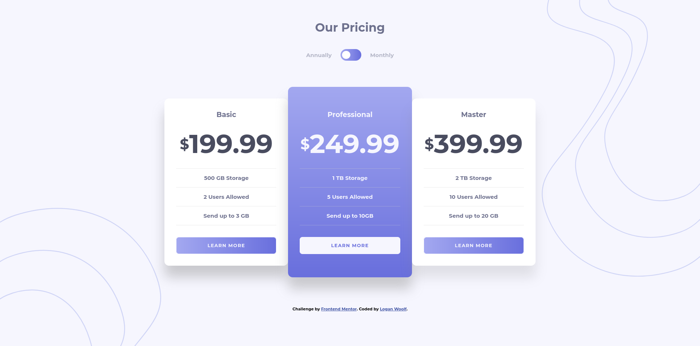
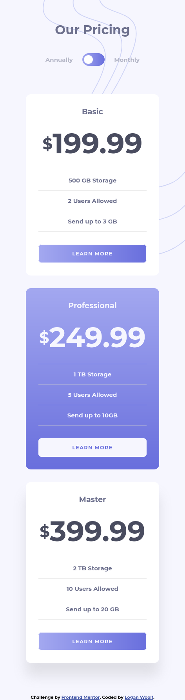

# Frontend Mentor - Pricing component with toggle solution

This is a solution to the [Pricing component with toggle challenge on Frontend Mentor](https://www.frontendmentor.io/challenges/pricing-component-with-toggle-8vPwRMIC). Frontend Mentor challenges help you improve your coding skills by building realistic projects. 

## Table of contents

- [Overview](#overview)
  - [The challenge](#the-challenge)
  - [Screenshot](#screenshot)
  - [Links](#links)
- [My process](#my-process)
  - [Built with](#built-with)
  - [What I learned](#what-i-learned)
  - [Useful resources](#useful-resources)
- [Author](#author)

## Overview

### The challenge

Users should be able to:

- View the optimal layout for the component depending on their device's screen size
- Control the toggle with both their mouse/trackpad and their keyboard
- **Bonus**: Complete the challenge with just HTML and CSS

### Screenshot




### Links

- Solution URL: [Add solution URL here](https://your-solution-url.com)
- Live Site URL: [https://loganwoolf.github.io/pricing-component/](https://loganwoolf.github.io/pricing-component/)

## My process

### Built with

- Semantic HTML5 markup
- CSS custom properties
- Flexbox
- CSS Grid
- Mobile-first workflow

### What I learned

- Cleaned up CSS massively by moving selector styles to a separate file and importing it.
```css
@import 'selector.css';
```

- As with colors, it is much easier to define your typography ahead of time than to adjust every single one throughout the project. I don't think there are any exceptions that came up after making this.
```css
h1 {
   font-size: 2rem;
   color: var(--dark2);
   margin: 0;
}
h2 {
   color: var(--dark2);
   font-size: 1.2rem;
   margin: 0;
}
h3 {
   color: var(--dark1);
   font-size: 4.5rem;
   margin: 0;
}
h3::before {
   content: "$";
   font-size: 2.5rem;
   vertical-align: 20%;
}
p {
   color: var(--dark2);
   margin: 0;
}
button {
   font-family: 'Montserrat', sans-serif;
   letter-spacing: 0.08rem;
   font-size: 0.8rem;
   cursor: pointer;
}
body {
   font-family: 'Montserrat', sans-serif;
   font-weight: 700;
   font-size: 15px;
}
```

- Used CSS custom property scoping top eliminate some repitition, example below on flex item dividers.
```css
.plan-benefit-container {
   --divider: 1.5px solid #ccc6;
}
.plan-benefit {
   border-bottom: var(--divider);
}
.plan-benefit:first-child {
   border-top: var(--divider);
}
```

- Had success in resizing a specific card type using CSS Grid Span. The featured card spans across the two small height grid rows at the top and bottom, and padding keeps the contents in line. This was a very quick fix.
```css
.price-card-container {
      display: grid;
      grid-template-columns: repeat(3, auto);
      grid-auto-rows: 2rem auto 2rem;
   }
   .price-card {
      grid-row: 2 / 3;
   }
   .featured {
      grid-row: 1 / 4;
      grid-column: 2 / 3;
      padding: 4rem 2rem; 
      /*Originally 2rem 2rem*/
   }
```

### Useful resources

- [https://dev.to/dcodeyt/creating-a-css-only-toggle-switch-5cg3](https://dev.to/dcodeyt/creating-a-css-only-toggle-switch-5cg3) - This example of a checkbox switch was very helpful. I took a few of the ideas and was able to make the project switch in no time.

## Author

- Website - [https://loganwoolf.github.io](https://loganwoolf.github.io)
- Frontend Mentor - [@loganwoolf](https://www.frontendmentor.io/profile/loganwoolf)
- Twitter - [@logan__woolf](https://www.twitter.com/logan__woolf)
